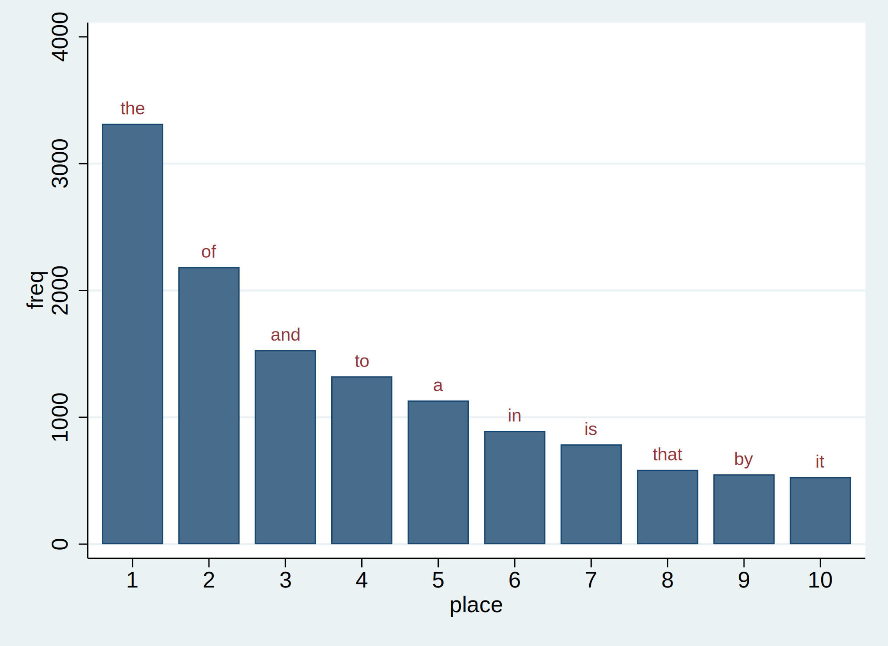
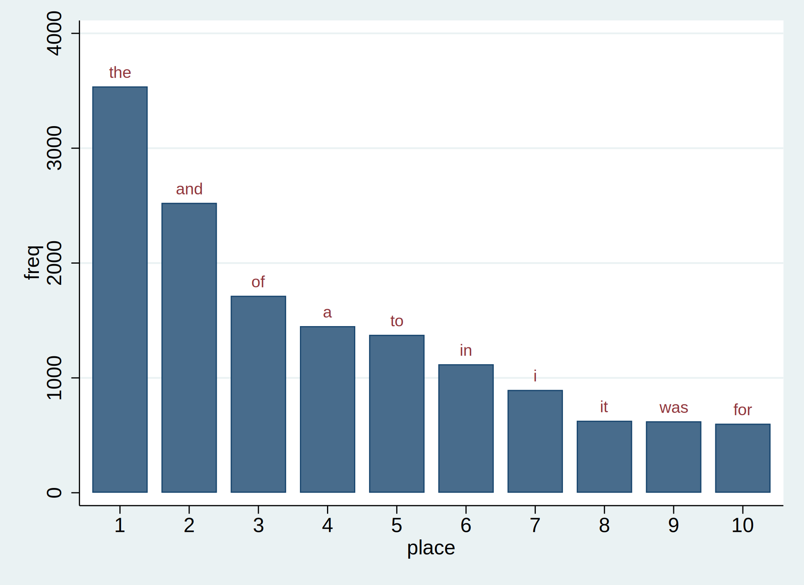

<head>
  <link rel="stylesheet" type="text/css" href="stmarkdown.css">

</head>

Introduction
========================

Let's imagine that we're interested in testing Zipf's Law in some of our favorite books.

## Zipf's Law

The most frequently-occurring word occurs approximately twice as often as the second most frequent word. This is Zipf's Law.

The texts we want to analyze are in .txt format:
<!--- we have to fake the ls command and then run with nocommands -->
<!--- because markdown is getting confused by the asterisk -->
<!--- so when we send output we have to escape the asterisk -->

~~~~

ls inputs/txt/*.txt
 347.1k  10/20/21 21:14  abyss.txt         
 321.9k  10/20/21 21:14  isles.txt         
1001.3k  10/20/21 21:14  last.txt          
 343.5k  10/20/21 21:14  sierra.txt        

~~~~

With the user-written command `wordfreq.ado` and a helper ado-file `countWords.ado`, we have written a do-file `count_isles.do` that takes the file `inputs/text/isles.txt` as an input and returns `outputs/data/dta/isles.dta`, a file with the frequency of each word in the input file. First, we count the frequency of words in the file `isles.txt`:

~~~~

. do code/count_isles.do

. version 16.1

. quietly include profile.do 
No resource locations have been stored with whereis

. 
. countWords, inputFile("isles.txt") outputFile("isles.dta")  
file outputs/data/dta/isles.dta saved

. 
. exit 

end of do-file

~~~~

(If you look at `countWords.ado`, you will notice that, to keep our do-files and this document tidy and simple, we have hard-coded some paths to our inputs and outputs. This is not good programming practice.)

Let's look at the top 5 lines in the output file `isles.dta`:

~~~~

. use outputs/data/dta/isles.dta, clear

. li in 1/5

     +------------------------+
     | word   freq      share |
     |------------------------|
  1. |  the   3315   .0625483 |
  2. |   of   2185   .0412272 |
  3. |  and   1530   .0288685 |
  4. |   to   1323   .0249627 |
  5. |    a   1132   .0213589 |
     +------------------------+

. clear

~~~~

We can do the same for another book, this time in the file `abyss.txt`:

~~~~

. do code/count_abyss.do

. version 16.1

. quietly include profile.do 
No resource locations have been stored with whereis

. 
. countWords, inputFile("abyss.txt") outputFile("abyss.dta")  
file outputs/data/dta/abyss.dta saved

. 
. exit 

end of do-file

. use outputs/data/dta/abyss.dta, clear

. li in 1/10

     +------------------------+
     | word   freq      share |
     |------------------------|
  1. |  the   3538   .0588284 |
  2. |  and   2524    .041968 |
  3. |   of   1715   .0285163 |
  4. |    a   1451   .0241266 |
  5. |   to   1375   .0228629 |
     |------------------------|
  6. |   in   1119   .0186063 |
  7. |    i    895   .0148817 |
  8. |   it    627   .0104255 |
  9. |  was    622   .0103424 |
 10. |  for    601   .0099932 |
     +------------------------+

. clear

~~~~

Now we want to visualize the results. We have written a do-file `plot_isles.do` that reads in `isles.dta` file and, with a helper ado-file `plotCounts.ado`, plots the 10 most frequently-occuring words in a bar chart, which it saves in `isles.png`.

~~~~

. qui do code/plot_isles.do

~~~~

We can do the same for `abyss`:

~~~~

. qui do code/plot_abyss.do

~~~~

Now we can test Zipf's law for these books. We have written a do-file `testZipf.do` that uses the files of counts we have created to produce an output file with the ratio of the first to the second for each input file.

~~~~

. qui do code/testZipf.do

. type outputs/tables/testZipf.txt
Book    First   Second  Ratio
isles   3315    2185    1.5171624
abyss   3538    2524    1.4017433

~~~~

This is reasonably close to Zipf's law.

Our workflow is as follows:

1. Read in a data file (text in this case).
2. Analyze this data file.
3. Save the results of the analysis to a new file.
4. Plot a graph of the results of the analysis
5. Save the graph as an image for later inclusion in a paper or other document
6. Repeat 1-5 for each of our input datasets
7. Combine results across datasets into a summary table

So far, we have been conducting steps 1-6 of this analysis one file at a time by running our do-files `count_isles.do`, `count_abyss.do`, `plot_isles.do` and `plot_abyss.do` on the command line, then conducting step 7 by running `testZipf.do`, again from the command line. This is fine for just two input files, but could become unwieldy if the number of input files or the number of steps in the workflow increased.

The standard solution in Stata is to write a "master" do-file to run this process. Here is an example, which we have named `master.do`:

~~~

version 16.1
// USAGE: do code/master.do
// to produce plots for isles and abyss
// and summary table for Zipf's law tests

// take the input file corresponding to each book, create frequency counts
quietly {
	do code/count_isles.do
	do code/count_abyss.do
}

// for each book, plot our graph in png format
quietly {
	do code/plot_isles.do 
	do code/plot_abyss.do
}

// combine results and summarize
quietly {
	do code/testZipf.do 
}

type outputs/tables/testZipf.txt

~~~

We can run the script again and see that the output is unchanged:

~~~~

. qui do code/master.do

. type outputs/tables/testZipf.txt
Book    First   Second  Ratio
isles   3315    2185    1.5171624
abyss   3538    2524    1.4017433

~~~~

Having a script (often called a master do-file) is a useful tool for reproducible results:

1. We have a record of our workflow
2. We can reproduce the full analysis with one command, `master.do`

However, it has a few important shortcomings, which we will illustrate using an example.

Suppose we wanted to narrow the bars in the graphs produced by `plotCounts.ado`. We edit the `twoway` command in `plotCounts.ado`, replacing `barwidth(0.8)` with, say, `barwidth(0.6)`.

Now we want to recreate our figures. This is easily done by running `master.do` again.

This will work, but what if the analysis steps took a very long time? Our do-files (and the ado-files they use) to produce our word counts have not changed, and our input files have not changed, so we know that our datasets of word counts (`isles.dta` and `abyss.dta`) will not change if we re-run our analysis steps. We should not have to re-run our full analysis just to make some changes to our graphs.

One common approach is to manipulate the `master.do` script. For example, if we knew that our input files and our word-counting program had not changed, we could comment out the relevant lines in `master.do`. That is, we could replace

~~~~

do code/count_isles.do
do code/count_abyss.do

~~~~

with

~~~~

// do code/count_isles.do
// do code/count_abyss.do

~~~~

so that `master.do` will skip over these lines and not re-run the analysis.

For a simple workflow, this is probably OK, but it can be a source of errors in more complicated workflows or in collaborative work. For example, in a complicated workflow, you might update an input file, but then forget that you had commented out the analysis lines in your script. Or, in a collaborative project, a co-author may have made a change to `countWords.ado` that you have not noticed.

In order to avoid both types of error -- re-running analyses that are not necessary or failing to update analyses when needed -- what we really want is an executable description of our pipeline that allows software to do the tricky part for us: figuring out what steps need to be rerun.

