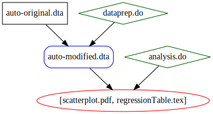
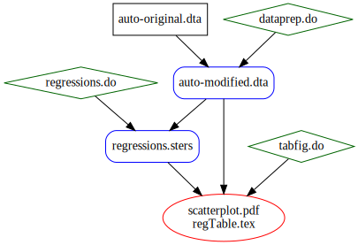

<head>
  <link rel="stylesheet" type="text/css" href="stmarkdown.css">

</head>

Separation of Concerns Part 1: Separating Analysis from Presentation
==========================

## Review of Introductory Example

In the first part of this two-part lesson, we revisit the *Introductory Example* of the main paper to implement the principle of *separation of concerns*. That example proceeded in two steps. First, in `dataprep.do`, we prepared our dataset `auto-modified.dta` for analysis. Then, in `analysis.do`, we ran our regressions and produced tables and figures. We reproduce the do-files, SConstruct, and workflow below. 

~~~~
// dataprep.do
version 16.1

use "inputs/auto-original.dta", clear

generate mpg_sqd = mpg^2
label variable mpg_sqd "Mileage (mpg) squared"

save "outputs/auto-modified.dta", replace

~~~~

~~~~
// analysis.do
version 16.1

use "outputs/auto-modified.dta", clear

twoway scatter price mpg, title("Price vs. MPG")
graph export "outputs/scatterplot.pdf", replace

regress price mpg
eststo linear

regress price mpg mpg_sqd
eststo quadratic

esttab linear quadratic using "outputs/regressionTable.tex", ///
  se r2 replace

~~~~

~~~~
# SConstruct-introExample
# **** Setup from pystatacons package *****
import pystatacons
env = pystatacons.init_env()

# use sconsign specific to this exercise
SConsignFile(".sconsignSeparation")

# **** Substance begins        *****

# analysis
cmd_analysis = env.StataBuild(
    target = ['outputs/scatterplot.pdf',
              'outputs/regressionTable.tex'],
    source = 'code/analysis.do',
    depends = ['outputs/auto-modified.dta'])

# dataprep
cmd_dataprep = env.StataBuild(
    target = ['outputs/auto-modified.dta'],
    source = 'code/dataprep.do',
    depends = ['inputs/auto-original.dta'])

~~~~

~~~~
. statacons --sconstruct=SConstruct-introExample ///
>         --debug=explain
scons: Reading SConscript files ...
Using 'LabelsFormatsOnly' custom_datasignature.
Calculates timestamp-independent checksum of dataset, 
  including variable formats, variable labels and value labels.
Edit use_custom_datasignature in config_project.ini to change.
  (other options are Strict, DataOnly, False)
scons: done reading SConscript files.
scons: Building targets ...
scons: building `outputs\auto-modified.dta' because it doesn't exist
stata_run(["outputs\auto-modified.dta"], ["code\dataprep.do"])
Running: StataMP-64.exe /e do "code\dataprep.do".
  Starting in hidden desktop (pid=13696).
scons: building `outputs\scatterplot.pdf' because it doesn't exist
stata_run(["outputs\scatterplot.pdf", "outputs\regressionTable.tex"], ["code\an
> alysis.do"])
Running: StataMP-64.exe /e do "code\analysis.do".
  Starting in hidden desktop (pid=13404).
scons: done building targets.

~~~~

## Separation of Concerns: The Problem

The issue with this workflow can be seen in the following example. Let's suppose that the regressions in `analysis.do` take a very long time to run. Furthermore, let's suppose that we wanted to improve the formatting of our graph, `scatterplot.pdf`, so that the y-axis labels are horizontal. We edit `analysis.do` to add `ylabels(, angle(horizontal))` to the command creating `scatterplot.gph`:

~~~~
// analysis.do
version 16.1

use "outputs/auto-modified.dta", clear

twoway scatter price mpg, title("Price vs. MPG") ///
  ylabels(, angle(horizontal))  
graph export "outputs/scatterplot.pdf", replace

regress price mpg
eststo linear

regress price mpg mpg_sqd
eststo quadratic

esttab linear quadratic using "outputs/regressionTable.tex", ///
  se r2 replace

~~~~

The problem will now become apparent if we ask `statacons` for the status of the project:

~~~~
. statacons --sconstruct=SConstruct-introExample -n --debug=explain
scons: Reading SConscript files ...
Using 'LabelsFormatsOnly' custom_datasignature.
Calculates timestamp-independent checksum of dataset, 
  including variable formats, variable labels and value labels.
Edit use_custom_datasignature in config_project.ini to change.
  (other options are Strict, DataOnly, False)
scons: done reading SConscript files.
scons: Building targets ...
scons: rebuilding `outputs\scatterplot.pdf' because `code\analysis.do' changed
stata_run(["outputs\scatterplot.pdf", "outputs\regressionTable.tex"], ["code\an
> alysis.do"])
scons: done building targets.

~~~~

As expected, `statacons` tells us that it will need to re-run `analysis.do`. This is wasteful -- we should not re-run all these regressions just to change the formatting of tables or figures.

## Separating Analysis from Presentation

The principle of *separation of concerns* suggests that we should split `analysis.do`: `regressions.do` should handle regressions; `tabfig.do` should take the regression results and produce tables and figures. To implement this, we need `regressions.do` to save regression results in `regressions.sters`, which `tabfig.do` can then use as an input.

Here are the new do-files, `regressions.do` and `tabfig.do`:

~~~~
// regressions.do
version 16.1

use "outputs/data/dta/auto-modified.dta", clear

// Linear regression
regress price mpg
eststo linear

// Quadratic regression
regress price mpg mpg_sqd
eststo quadratic

// save linear and quadratic regression results in .sters file
estwrite linear quadratic using outputs/regressions.sters, ///
  reproducible replace
exit

~~~~

~~~~
// tabfig.do

use "outputs/data/dta/auto-modified.dta", clear
// read previous regression results from saved .sters file.
estimates clear
estread using "outputs/regressions.sters"

// create scatter plot
twoway scatter price mpg, title("Price vs. MPG") ///
  ylabels(, angle(horizontal))
graph export "outputs/scatterplot.pdf", replace

// create *.tex file
esttab linear quadratic using "outputs/regressionTable.tex", ///
  se r2 label replace

~~~~

We create a new SConstruct, `SConstruct-separation`, with this new workflow.

~~~~
# SConstruct-separation

# **** Setup from pystatacons package *****
import pystatacons
env = pystatacons.init_env()

# use sconsign specific to this exercise
SConsignFile(".sconsignSeparation")

# separate analysis from tables and figures

# **** Substance begins        *****

# tables and figures
cmd_tabfig = env.StataBuild(
    target = ['outputs/scatterplot.pdf',
              'outputs/regressionTable.tex'],
    source = 'code/tabfig.do',
    depends = ['outputs/auto-modified.dta',
               'outputs/regressions.sters']
)

# regressions
cmd_regressions = env.StataBuild(
    target = ['outputs/regressions.sters'],
    source = 'code/regressions.do',
    depends = ['outputs/auto-modified.dta']
)

# dataprep
cmd_dataprep = env.StataBuild(
    target = ['outputs/auto-modified.dta'],
    source = 'code/dataprep.do',
    depends = ['inputs/auto-original.dta']
)

~~~~

This workflow is illustrated in the following figure:

We build the project from scratch:

~~~~

. statacons --sconstruct=SConstruct-separation -c
scons: Reading SConscript files ...
scons: done reading SConscript files.
scons: Cleaning targets ...
Removed outputs\auto-modified.dta
Removed outputs\scatterplot.pdf
Removed outputs\regressionTable.tex
scons: done cleaning targets.

. statacons --sconstruct=SConstruct-separation ///
>         --debug=explain
scons: Reading SConscript files ...
Using 'LabelsFormatsOnly' custom_datasignature.
Calculates timestamp-independent checksum of dataset, 
  including variable formats, variable labels and value labels.
Edit use_custom_datasignature in config_project.ini to change.
  (other options are Strict, DataOnly, False)
scons: done reading SConscript files.
scons: Building targets ...
scons: building `outputs\auto-modified.dta' because it doesn't exist
stata_run(["outputs\auto-modified.dta"], ["code\dataprep.do"])
Running: StataMP-64.exe /e do "code\dataprep.do".
  Starting in hidden desktop (pid=21636).
scons: building `outputs\regressions.sters' because it doesn't exist
stata_run(["outputs\regressions.sters"], ["code\regressions.do"])
Running: StataMP-64.exe /e do "code\regressions.do".
  Starting in hidden desktop (pid=8796).
scons: building `outputs\scatterplot.pdf' because it doesn't exist
stata_run(["outputs\scatterplot.pdf", "outputs\regressionTable.tex"], ["code\ta
> bfig.do"])
Running: StataMP-64.exe /e do "code\tabfig.do".
  Starting in hidden desktop (pid=4784).
scons: done building targets.

~~~~

## Testing separation

Now let's test whether our separation of concerns has been successful. Let's change the number of significant digits in our regression table from the default to 2.

~~~~

// tabfig.do

use "outputs/data/dta/auto-modified.dta", clear
// read previous regression results from saved .sters file.
estimates clear
estread using "outputs/regressions.sters"

// create scatter plot
twoway scatter price mpg, title("Price vs. MPG") ///
  ylabels(, angle(horizontal))
graph export "outputs/scatterplot.pdf", replace

// create *.tex file
esttab linear quadratic using "outputs/regressionTable.tex", ///
  se r2 label b(a2) replace

~~~~

Let's see what `statacons` does and does not rebuild.

~~~~

. statacons --sconstruct=SConstruct-separation ///
>         --debug=explain
scons: Reading SConscript files ...
Using 'LabelsFormatsOnly' custom_datasignature.
Calculates timestamp-independent checksum of dataset, 
  including variable formats, variable labels and value labels.
Edit use_custom_datasignature in config_project.ini to change.
  (other options are Strict, DataOnly, False)
scons: done reading SConscript files.
scons: Building targets ...
scons: rebuilding `outputs\scatterplot.pdf' because `code\tabfig.do' changed
stata_run(["outputs\scatterplot.pdf", "outputs\regressionTable.tex"], ["code\ta
> bfig.do"])
Running: StataMP-64.exe /e do "code\tabfig.do".
  Starting in hidden desktop (pid=24400).
scons: done building targets.

~~~~

Notice that `statacons` does rebuild the outputs of `tabfig.do` because `tabfig.do` has changed, but does not re-run any regressions.

## Metadata (variable labels)

Now let's suppose that we want to edit the labels of our variables, for example to change the label of **price** from "Price" to "Price (USD)".

~~~~
// dataprep.do
version 16.1 

use "inputs/auto-original.dta", clear

generate mpg_sqd = mpg^2
label variable mpg_sqd "Mileage (mpg) squared"

label variable price "Price (USD)"

save "outputs/auto-modified.dta", replace

~~~~

Through `statacons`, we can see the issue this will create: because we are changing `dataprep.do` and its target `auto-modified.dta`, we need to rebuild `regTable.tex`, which depends on `auto-modified.dta`:

~~~~
. statacons --sconstruct=SConstruct-separation ///
>         --debug=explain
scons: Reading SConscript files ...
Using 'LabelsFormatsOnly' custom_datasignature.
Calculates timestamp-independent checksum of dataset, 
  including variable formats, variable labels and value labels.
Edit use_custom_datasignature in config_project.ini to change.
  (other options are Strict, DataOnly, False)
scons: done reading SConscript files.
scons: Building targets ...
scons: rebuilding `outputs\auto-modified.dta' because `code\dataprep.do' change
> d
stata_run(["outputs\auto-modified.dta"], ["code\dataprep.do"])
Running: StataMP-64.exe /e do "code\dataprep.do".
  Starting in hidden desktop (pid=18800).
scons: rebuilding `outputs\regressions.sters' because `outputs\auto-modified.dt
> a' changed
stata_run(["outputs\regressions.sters"], ["code\regressions.do"])
Running: StataMP-64.exe /e do "code\regressions.do".
  Starting in hidden desktop (pid=25404).
scons: rebuilding `outputs\scatterplot.pdf' because `outputs\auto-modified.dta'
>  changed
stata_run(["outputs\scatterplot.pdf", "outputs\regressionTable.tex"], ["code\ta
> bfig.do"])
Running: StataMP-64.exe /e do "code\tabfig.do".
  Starting in hidden desktop (pid=5116).
scons: done building targets.

~~~~

To avoid re-running `regressions.do`, we could manually adjust the label of **price** in `tabfig.do`. However, this could lead to inconsistency across analyses and contradicts the goal of an automatic workflow. We will take up this problem in the next lesson.

